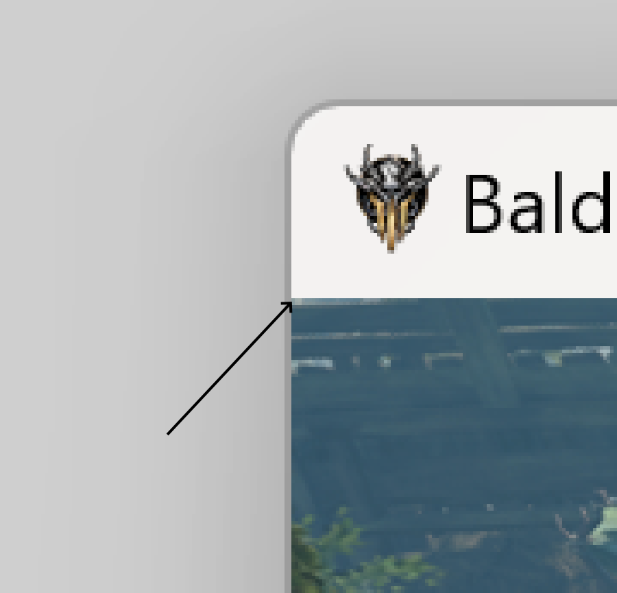
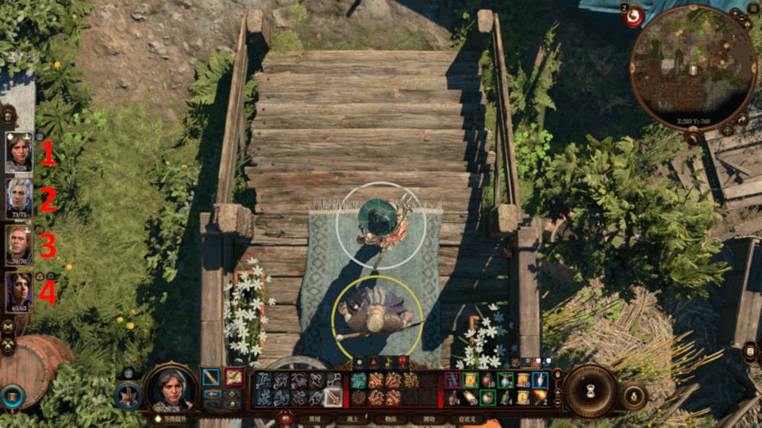

# 自动刷新商人并将指定物品放置到容器中

基本上就是给一个角色不停洗点成战士然后给它升级(可以召唤工具人来搞这个避免破坏bd)，然后让蹲点的其他角色去把想要的物品从商人那里拖到商人的一个容器那里，这样刷新后不会消失，最后是0元购还是老实付款都可以 。

想要的物品图标放进指定目录就可以实现识别。

## 需要

新一点版本的python3（我用的3.11），opencv，numpy，pyautogui，pydirectinput，pywin32。requirements.txt 里有。

## 使用
1. 将博德之门设置为窗口模式运行，分辨率设置为1920x1080，全屏截图，在画图板中打开，记录下游戏左上角（不含边框）像素的x和y坐标，就是下图箭头所指的位置。

2. 确保总共有4名角色激活，并解除队伍锁定。
3. 打开战术镜头并将镜头推至最近的位置
4. 将洗点/加点工具人放在耶格正上方，将采购的队友放在商人正上方。两者都是要尽量与NPC相切。需要商人必须是固定的商人，不能走来走去。如下图所示。

5. 将所有人技能栏设置为两行。
6. 给所有的使用的商人卖一个容器，在容器里预先放一些商人的东西，使得其按照重量排序时可以排在第一位。
7. 将所需物品截图，放在`item_icons`目录下。截图应当是40*23尺寸的（只截取上半截，这样可以裁掉下半截的数量）。
8. 记录角色排序，以及商人进入购买界面的数字选项。（上图中红色数字所示顺序）
9. 运行`main.py`，依序输入上述信息后，在屏幕出现提示的时候及时将博德之门窗口放到最前（位置不能变）。

以下是一次输入的示例：
```
请输入博德之门窗口左上角像素坐标，用逗号分隔，先x后y：
329,306
请输入当前可以升到的最高等级：
10
请输入循环次数：
1
请输入角色的头像编号（1-4），第一个是升级的角色，之后的是进货的角色，用逗号隔开：
1,2,4
请输入对话选项的编号（1-4），第一个是升级的角色洗点的对话选项，之后的是进货的角色进入购买界面的编号，用逗号隔开：
4,1,2
```


## 包含的图标：
aomt.png 多靶箭
aos.png 必杀箭
gold.png 金币
cgf.png 云巨人手指
eocgs.png 云巨人力量灵药
poh3.png 3级治疗药水
不需要的物品图标可以删除掉，节约时间。
